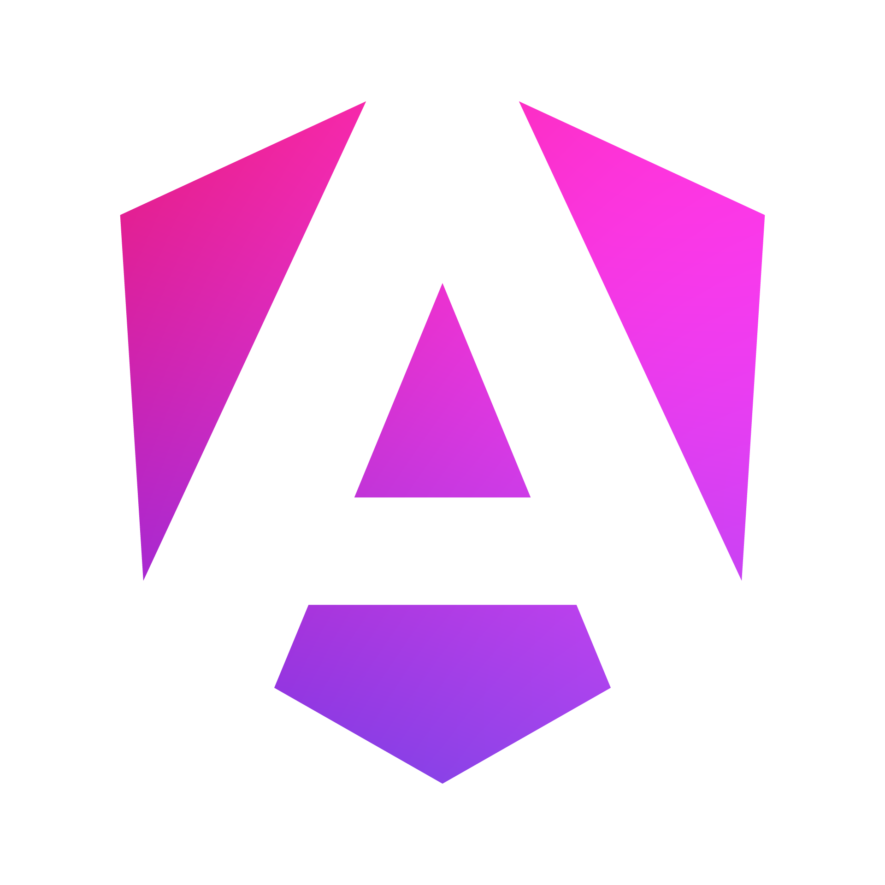

# Codequest 2024

The project is a difficulty evaluation and gamification system designed to provide data and tools for two user groups – **Developers** and **Project Managers** – to manage tasks and enhance motivation.

---

## User Groups and Features

### Developers
- **Measuring Task Difficulty:** The system automatically assesses task difficulty with the help of artificial intelligence.
- **Data Collection and Analysis:** The evaluated difficulty levels are saved, allowing for reports to be generated, which supports developers' professional growth and transparency.

### Project Managers
- **Task Review:** Project managers can view the tasks completed by developers, including assigned difficulty levels.
- **Reward System:** Project managers can provide motivational rewards based on evaluations, recognizing the successful completion of more challenging tasks.

---

## Tools Used

The following tools and technologies are used in this project:

|  |  |  |  |  |  |  |  |  |
|:--:|:--:|:--:|:--:|:--:|:--:|:--:|:--:|:--:|
| **Jira API** | **Nvidia AI** | **NestJS** | **Angular** | **Spartan UI** | **TailwindCSS** | **GitHub Pages** | **Heroku** | **Mongo DB** |

### Running the App

```bash
# development backend
npm run start:dev

# development frontend
npm run start
```

#### Production Url
https://danielolasz.github.io/codequest/welcome
